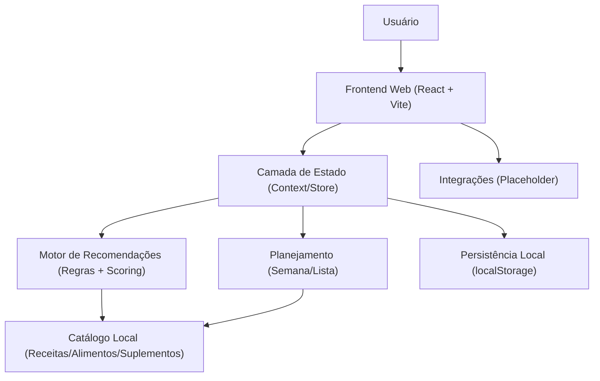
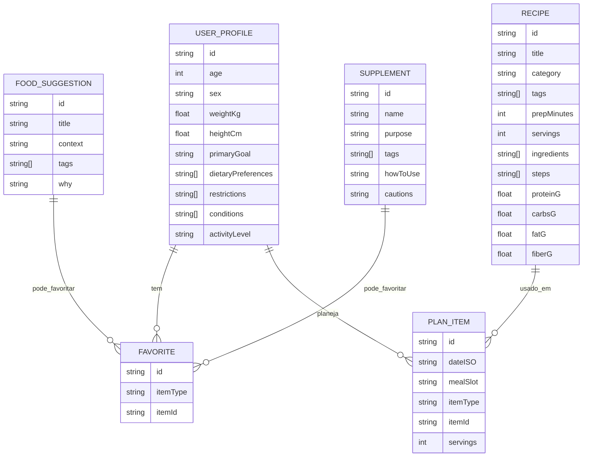

## 1. Desenho de Arquitetura

## 2. Descrição de Tecnologias
- Frontend: React@18 + TypeScript + Vite
- Estilo: tailwindcss@3 (design tokens via CSS variables)
- Roteamento: react-router-dom (SPA)
- Persistência: localStorage (backup/restore via JSON)
- Inicialização: create-vite (template React + TS)
- Backend: Nenhum (MVP)
- Dados: catálogo local em JSON/TS (seed), editável futuramente via backend

## 3. Definições de Rotas
| Rota | Propósito |
|------|-----------|
| / | Redireciona para /painel (se perfil existir) ou /perfil |
| /perfil | Criar/editar perfil do usuário |
| /painel | Recomendações por objetivo e categoria |
| /receitas | Lista de receitas |
| /receitas/:id | Detalhe da receita |
| /alimentos | Sugestões rápidas e combinações |
| /suplementos | Guia de suplementos e combos |
| /plano | Planejamento semanal |
| /compras | Lista de compras |
| /insights | Alertas e lacunas prováveis |
| /configuracoes | Preferências, export/import, reset e integrações (placeholder) |

## 4. Definições de API (sem backend no MVP)
Sem API no MVP. O app usa um catálogo local e armazena o estado no dispositivo.

## 5. Modelo de Dados

### 5.1 Definição do Modelo (ER)

### 5.2 Regras do Motor de Recomendações (MVP)
- Base: catálogo local com tags (ex.: lowGI, lowSodium, highProtein, lactoseFree, glutenFree).
- Perfil → filtro: remove itens incompatíveis com restrições (ex.: lactose) e preferências (ex.: vegano).
- Perfil → scoring:
  - Saúde geral: prioriza fiberG e diversidade de micronutrientes (proxy por tags “highFiber”, “richInIron”, etc.).
  - Diabetes: prioriza “lowGI”, “highFiber”, reduz “highSugar”.
  - Hipertensão: prioriza “lowSodium”, reduz “highSodium”.
  - Performance: prioriza proteinG e contexto (pré/pós-treino), inclui suplementos compatíveis.
- Transparência: cada recomendação inclui uma lista curta de motivos (tags traduzidas em linguagem natural).

## 6. Estrutura de Pastas (Proposta)
- src/
  - app/ (bootstrap, providers, rotas)
  - pages/ (templates de páginas)
  - components/ (UI reutilizável)
  - domain/
    - models/ (tipos)
    - recommend/ (motor de recomendações)
    - nutrition/ (cálculos simples, metas, alertas)
  - data/ (catálogo local)
  - storage/ (persistência e migração de schema)
  - styles/ (tokens, tema, utilitários)

## 7. Preparação para “Web + Mobile”
- Layout responsivo com navegação por bottom bar em telas pequenas.
- Separação de domínio (src/domain) para futura reutilização em Expo.
- Tokens de design (cores, espaçamento, tipografia) centralizados para facilitar portabilidade.
