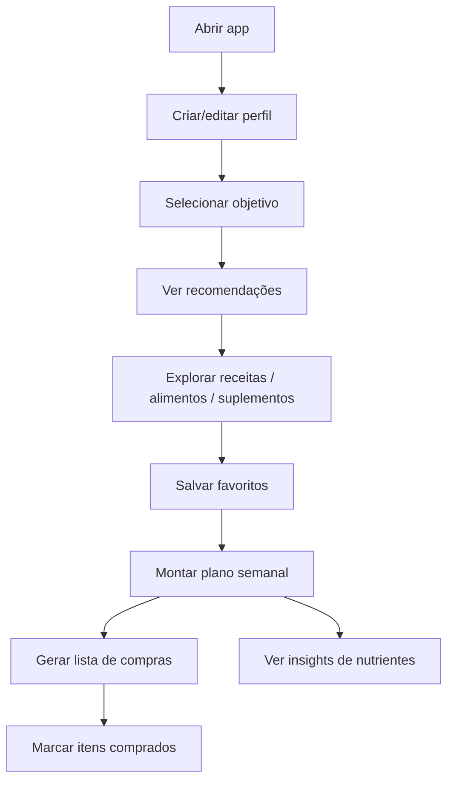

## 1. Visão Geral do Produto
Um app de nutrição inteligente que recomenda receitas, alimentos e suplementos de forma personalizada por objetivo (saúde, tratamento, performance).
Foco em praticidade: plano semanal, lista de compras automática e alertas de nutrientes, com dados salvos localmente no dispositivo.

## 2. Funcionalidades Principais

### 2.1 Papéis de Usuário
| Papel | Método de uso | Permissões principais |
|------|---------------|------------------------|
| Usuário | Sem login (MVP) | Criar/editar perfil, gerar recomendações, planejar refeições, ver alertas e lista de compras |

### 2.2 Módulos (Páginas Essenciais)
1. **Boas-vindas / Perfil**: coleta de dados (idade, sexo, peso, altura), objetivo e preferências/restrições.
2. **Painel (Recomendações)**: cards por categoria (Saúde, Doenças, Performance) com filtros e explicação do porquê.
3. **Receitas**: lista com busca/filtros + detalhe completo (ingredientes, modo de preparo, macros estimados, substituições).
4. **Alimentos & Combinações**: sugestões rápidas (“banana + aveia”), por contexto (pré-treino, lanche, café da manhã).
5. **Suplementos**: recomendações e combinações (whey, creatina, BCAA) com avisos e melhores horários.
6. **Plano Semanal**: montagem de refeições por dia/horário, com duplicar/arrastar e visão de macros por dia.
7. **Lista de Compras**: agregação automática do plano semanal, com checkbox e agrupamento por seção (hortifruti, proteínas, etc.).
8. **Insights (Nutrientes)**: alertas e “lacunas” prováveis (ferro, fibras, proteína), com sugestões de correção.
9. **Configurações**: preferências, unidades (kg/lb), modo claro/escuro, exportação/importação local e integrações (placeholder).

### 2.3 Detalhamento por Página
| Nome da Página | Módulo | Descrição da funcionalidade |
|---|---|---|
| Boas-vindas / Perfil | Formulário de Perfil | Campos com validação, presets de preferências (vegano, low carb), restrições (glúten/lactose) e condições (diabetes, hipertensão). |
| Boas-vindas / Perfil | Objetivo | Seleção guiada (Saúde, Tratamento, Performance) com exemplos do que muda nas recomendações. |
| Painel | Categorias | Abas (Saúde / Doenças / Performance) + chips de filtros (sem lactose, sem glúten, vegetariano, low carb). |
| Painel | “Por que isso?” | Cada recomendação mostra 2–3 motivos (ex.: “baixo índice glicêmico”, “rico em fibras”). |
| Receitas | Lista & Busca | Busca por nome/ingrediente, filtros por tempo/preparo e restrições. |
| Receitas | Detalhe | Ingredientes, modo de preparo, porções, tempo, macros estimados, substituições e “combina bem com…”. |
| Alimentos & Combinações | Sugestões rápidas | Sugestões unitárias e combos com contexto (energia rápida, saciedade, pós-treino). |
| Suplementos | Biblioteca | Cards para whey/creatina/BCAA com orientações gerais e avisos (MVP, sem prescrição médica). |
| Suplementos | Combinações | Exemplos: “whey + pasta de amendoim (pós-treino)”, “creatina diária com refeição”. |
| Plano Semanal | Editor de Semana | Grade semanal com slots (café/almoço/jantar/lanche) e ação “gerar semana” a partir do objetivo. |
| Plano Semanal | Resumo | Totais do dia/semana (proteína/carbo/fat/fibras), metas e alertas. |
| Lista de Compras | Agrupamento | Agrupa por categoria, soma quantidades quando possível, marca itens comprados. |
| Insights | Alertas | Lista priorizada de ajustes (ex.: “falta proteína no café da manhã”). |
| Configurações | Persistência | Backup/restore local (JSON), reset de dados e preferências de tema. |

## 3. Processo Principal
Fluxo típico: o usuário cria seu perfil e objetivo → o app recomenda conteúdos por categoria → o usuário salva receitas e monta o plano semanal → o app gera a lista de compras e mostra alertas de nutrientes.

## 4. Design de Interface
### 4.1 Estilo Visual
- Paleta: base escura “verde-profundo” e “carvão”, com acentos “limão” e “pêssego”, e superfícies em verde-acinzentado.
- Botões: cantos arredondados médios, com realce interno e microanimações (hover/press) para sensação tátil.
- Tipografia: título editorial com serifa expressiva + texto com sans legível (sem aparência genérica).
- Layout: cards com bordas sutis, ícones minimalistas e visual “culinário” (texturas leves, gradientes orgânicos).
- Ícones/emoji: ícones lineares consistentes; emojis apenas como apoio em títulos de seção (opcional).

### 4.2 Visão de UI por Página
| Nome da Página | Módulo | Elementos de UI |
|---|---|---|
| Boas-vindas / Perfil | Formulário | Stepper, inputs com máscara, chips de restrições, seletor de objetivo em cards. |
| Painel | Recomendações | Abas, cards com tags, seção “por que isso?”, botão “Adicionar ao plano”. |
| Receitas | Lista | Search bar, filtros, grid responsivo, skeleton/loading. |
| Receitas | Detalhe | Hero com imagem, tabela de ingredientes, passos em timeline, macros em badges. |
| Plano Semanal | Editor | Grade semanal, drag-and-drop (MVP: mover por menu), resumo lateral de macros. |
| Lista de Compras | Checklist | Itens agrupados, contador de itens restantes, modo “mercado” (fonte maior). |
| Insights | Alertas | Cards com severidade (baixo/médio/alto), ações rápidas de correção. |
| Configurações | Preferências | Toggle de tema, export/import JSON, reset, integrações (placeholder). |

### 4.3 Responsividade
Desktop-first com adaptação para mobile: navegação por bottom bar no mobile, grid vira lista, áreas de toque ampliadas e “modo mercado” na lista de compras.
